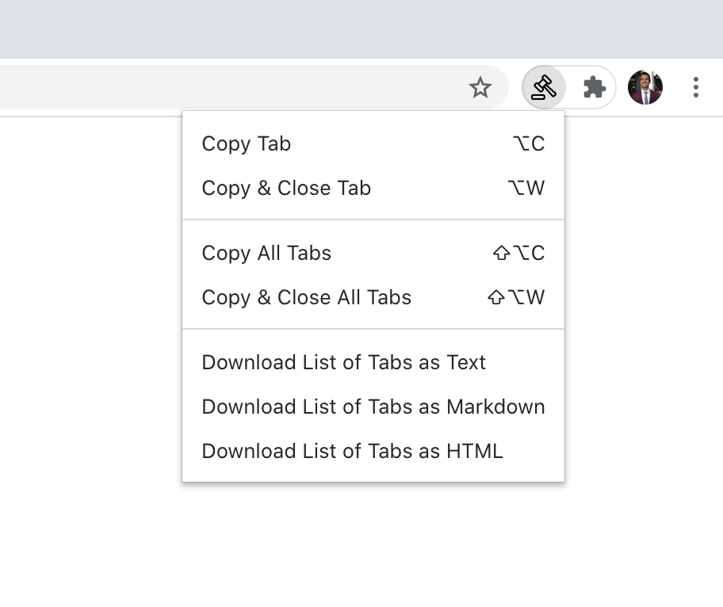

# Tab Bankruptcy

A Chrome extension to quickly copy your list of open tabs to the clipboard. Useful for pasting into a Google Doc or any other to-do list.

When copying all closing all tabs, pinned tabs are skipped.

## Keyboard shortcuts

- `Alt+C`: copy the current tab title and URL to the clipboard
- `Alt+Shift+C`: copy all tab titles and URLs to the clipboard
- `Alt+W`: copy the current tab title and URL to the clipboard and close the tab
- `Alt+Shift+W`: copy all tab titles and URLs to the clipboard and close all tabs

## Rich text

If you paste into a rich text app (like Google Docs), the list of tabs will be a nicely formatted list, with links, like this:

> - Window 1
>   - [Hacker News](https://news.ycombinator.com/)
>   - [Home / Twitter](https://twitter.com/home)
> - Window 2
>   - [Stefano J. Attardi: UI Engineering and Design consultant](https://attardi.org/)
>   - [steadicat (Stefano J. Attardi)](https://github.com/steadicat)
>   - [Swarmation :: The Multiplayer Pixel Formation Game](https://swarmation.com/)
